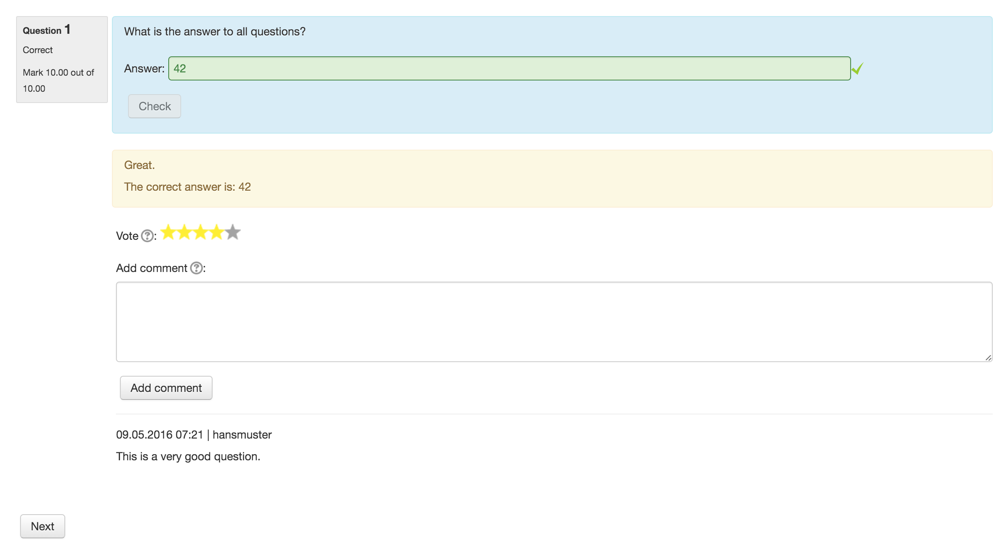

# moodle-qbehaviour_studentquiz

The Student-Quiz Question Behaviour extends the immediate feedback question behaviour. 
In addition to the immediate feedback the Student-Quiz Question Behaviour allows you to rate 
and comment question after the user checked the answer for grading.  

## Installation

The Student-Quiz Question Behaviour depends on the Student-Quiz activity. First install
[Student-Quiz Activity](https://github.com/frankkoch/moodle-mod_studentquiz).

The simplest way to install the Student-Quiz Question Behaviour is going to the *Site administration -> Plugins -> Install plugins* page. 

**Important:** The zip and the folder name in the zip have to be named *studentquiz*.

## License

[GNU GPL v3 or later](http://www.gnu.org/copyleft/gpl.html) 

## Moodle Version

Supported is Moodle v3. Not tested with Moodle v2.

## Copyright

[Hochschule für Technik Rapperswil](https://www.hsr.ch/)