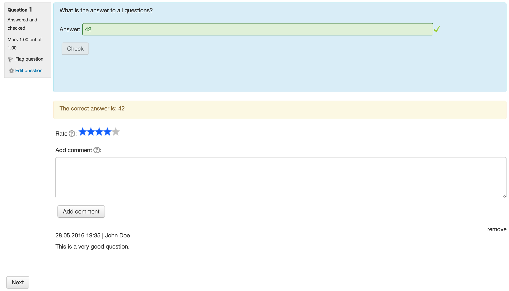

# moodle-qbehaviour_studentquiz

The studentquiz question behaviour extends the immediate feedback question behaviour. 
In addition to the immediate feedback the studentquiz behaviour allows you to rate 
and comment on questions in quizzes. After the immediate feedback of a question
the behaviour shows the rating using stars and user comments. The users have to rate the questions answered and 
can add a comment.

## Installation

The studentquiz question behaviour depends on the studentquiz activity. First install
[Studentquiz Activity](https://github.com/frankkoch/moodle-mod_studentquiz).

Download the zip file from github. Unzip the downloaded file *moodle-qbehaviour_studentquiz-master.zip*,
rename it to *studentquiz* and move it to your *moodle_installation_path/question/behaviour/*. Login as 
an Admin and follow the installation instructions. 

Another way to install the studentquiz behaviour is going to the *Site administration -> Plugins -> Install plugins* page. 
Note that the folder name and the zip have to be named *studentquiz*.

## License

[GNU GPL v3 or later](http://www.gnu.org/copyleft/gpl.html) 

## Moodle Version

Supported is Moodle v3. Not tested with Moodle v2.

## Copyright

[Hochschule für Technik Rapperswil](https://www.hsr.ch/)